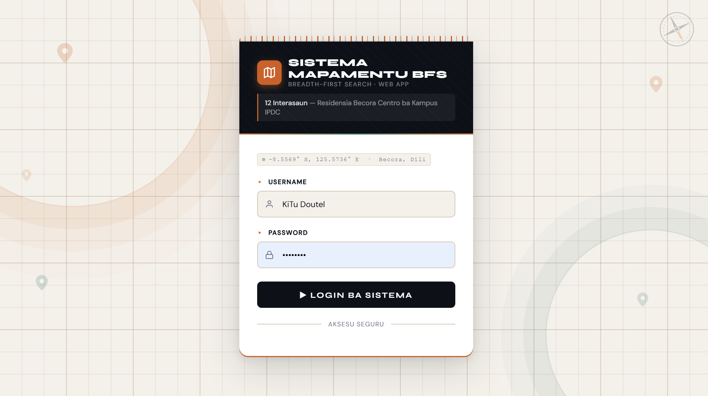
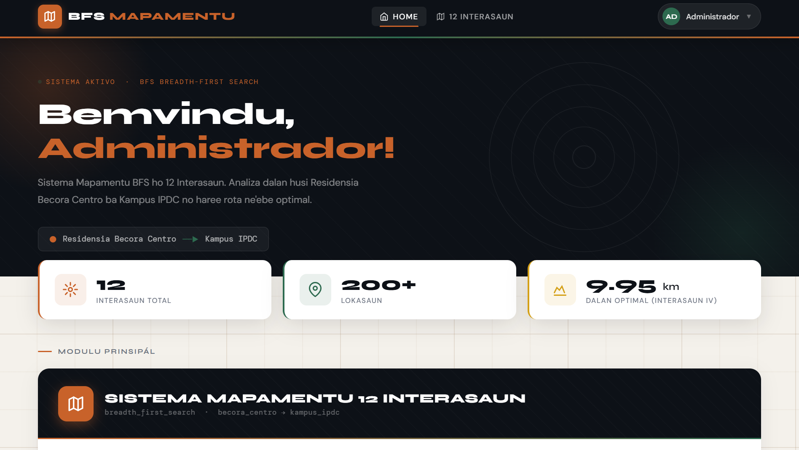
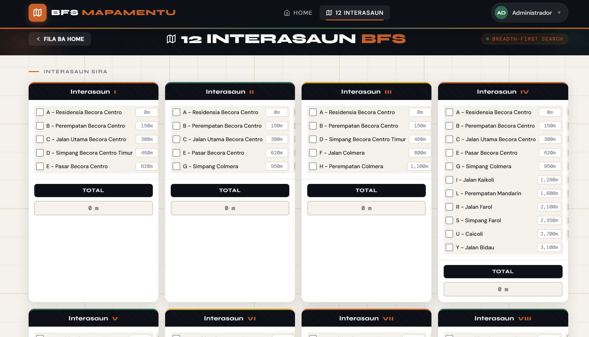

# 🗺️ BFS Mapping System

[](https://www.php.net/)
[](https://www.mysql.com/)
[](https://getbootstrap.com/)
[](LICENSE)

> **An intelligent route mapping system using Breadth-First Search (BFS) algorithm to find the optimal path from Becora Centro Residence to IPDC Campus.**

---

## 📋 Table of Contents

- [About](#-about)
- [Features](#-features)
- [Screenshots](#-screenshots)
- [Installation](#-installation)
- [Usage](#-usage)
- [Database Schema](#-database-schema)
- [Technology Stack](#-technology-stack)
- [Project Structure](#-project-structure)
- [Contributing](#-contributing)
- [License](#-license)
- [Author](#-author)

---

## 🔍 About

**BFS Mapping System** is a web-based application designed to analyze and compare 12 different route intersections from **Becora Centro Residence** to **IPDC Campus** in Dili, Timor-Leste. 

The system implements the **Breadth-First Search (BFS)** algorithm to calculate distances, visualize routes, and identify the most efficient path among multiple intersection scenarios.

### Key Highlights:
- 🎯 **12 Different Intersections** to analyze
- 📊 **Real-time distance calculation**
- 💾 **MySQL database integration**
- 🎨 **Modern, responsive UI design**
- 🔐 **Secure authentication system**

---

## ✨ Features

- ✅ **User Authentication** - Secure login system with session management
- 🗺️ **12 Intersection Analysis** - Compare multiple route options
- 📏 **Distance Calculator** - Calculate total distance for each intersection
- 🏆 **Optimal Route Detection** - BFS algorithm identifies the shortest path
- 💾 **Database Storage** - Save and retrieve calculation results
-  **Responsive Design** - Works seamlessly on desktop, tablet, and mobile
- 🎨 **Modern UI/UX** - Clean interface with smooth animations
-  **Visual Progress Tracking** - Real-time progress bars and statistics
- 🔍 **Location Selection** - Checkbox-based location filtering
- 📝 **Export Results** - Save analysis results to database

---

## 📸 Screenshots

### 🔐 Login Page

*Secure authentication page with modern design*

### 🏠 Dashboard Home

*Main dashboard showing statistics and system overview*

### 🗺️ 12 Intersections Analysis

*Interactive interface for route analysis and calculation*

---

## 🚀 Installation

### Prerequisites
- **PHP** >= 8.1
- **MySQL** >= 8.0
- **Web Server** (Apache/Nginx)
- **Composer** (optional)

### Step-by-Step Setup

1. **Clone the repository**
   ```bash
   git clone https://github.com/yourusername/bfs-mapping.git
   cd bfs-mapping